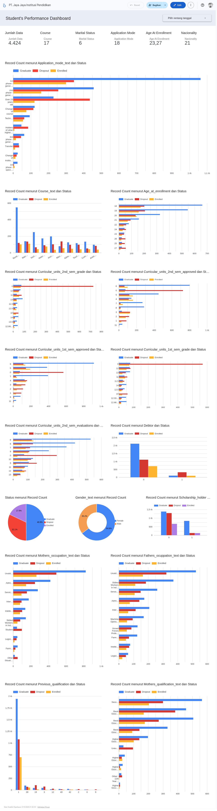

# Proyek Akhir: Menyelesaikan Permasalahan Perusahaan Edutech

## Business Understanding
Jelaskan latar belakang bisnis dari perushaan tersebut.

Jaya Jaya Institut merupakan salah satu institusi pendidikan tinggi yang telah berdiri sejak tahun 2000. Selama lebih dari dua dekade, institusi ini telah meluluskan ribuan mahasiswa dengan reputasi yang sangat baik, serta berkontribusi dalam mencetak tenaga profesional di berbagai bidang.

Namun, seiring bertambahnya jumlah mahasiswa dengan latar belakang sosial, ekonomi, dan akademik yang beragam, institusi mulai menghadapi tantangan serius: meningkatnya jumlah mahasiswa yang tidak menyelesaikan pendidikannya atau mengalami dropout. Fenomena ini tidak hanya berdampak pada perkembangan akademik individu mahasiswa, tetapi juga membawa konsekuensi serius bagi reputasi dan kredibilitas institusi secara keseluruhan, seperti:

- Menurunnya tingkat kepercayaan publik,

- Berkurangnya daya tarik calon mahasiswa baru,

- Hingga potensi penurunan akreditasi di masa depan.

Menyadari pentingnya isu ini, Jaya Jaya Institut mengambil langkah proaktif dengan melibatkan peran data scientist untuk membantu mengidentifikasi faktor-faktor utama penyebab dropout mahasiswa. Melalui pendekatan berbasis data, diharapkan institusi mampu mendeteksi lebih dini mahasiswa yang berpotensi mengalami dropout agar dapat diberikan intervensi dan pendampingan secara tepat.

Selain itu, institusi juga membutuhkan sebuah dashboard interaktif yang dapat menampilkan visualisasi data secara komprehensif, sehingga memudahkan pihak manajemen dan akademik dalam:

- Memahami pola dan tren dropout,

- Menyusun strategi pencegahan yang lebih efektif,

- Serta memonitor dampak dari kebijakan yang telah diterapkan.

Dengan solusi ini, diharapkan Jaya Jaya Institut dapat membangun ekosistem pendidikan yang lebih inklusif, responsif, dan adaptif terhadap kebutuhan mahasiswa, serta secara signifikan mengurangi tingkat dropout di masa mendatang.

### Permasalahan Bisnis
Tuliskan seluruh permasalahan bisnis yang akan diselesaikan.

    1. Bagaimana cara mengidentifikasi mahasiswa yang berpotensi mengalami dropout sejak dini?
    2. Faktor-faktor apa saja yang paling berpengaruh terhadap tingkat dropout mahasiswa di Jaya Jaya Institut?
    3. Bagaimana cara menyajikan data dropout mahasiswa dalam bentuk visualisasi yang mudah dipahami oleh pihak manajemen dan akademik?
    4. Apakah terdapat perbedaan tingkat dropout berdasarkan demografi, status akademik, atau latar belakang sosial ekonomi mahasiswa?
    5. Apa solusi yang mungkin bisa di implementasikan untuk menurunkan angka "Dropout" mahasiswa ?

### Cakupan Proyek
Tuliskan cakupan proyek yang akan dikerjakan.

    1.  Analisis data mahasiswa berdasarkan dataset yang disediakan, Melakukan eksplorasi dan pembersihan data untuk memahami struktur dan kualitas data sebagai dasar analisis lebih lanjut.
    2. Identifikasi faktor-faktor penyebab utama tingginya "Dropout" , Menggunakan teknik statistik dan machine learning untuk menemukan variabel-variabel yang paling memengaruhi kecenderungan karyawan untuk keluar.
    3. Pembangunan sistem monitoring berbasis machine learning dan Looker Google, Mengembangkan sistem prediktif dan visualisasi interaktif untuk memantau pola attrition, memprediksi risiko, dan menyajikan insight kepada tim HR secara real time.
    4. Melakukan deployment model melalui layanan Streamlit Community agar dapat digunakan untuk prediksi, mendapatkan insight serta dapat diakses secara public.

### Persiapan

Sumber data: Github [Student Performace's] : 'https://raw.githubusercontent.com/dicodingacademy/dicoding_dataset/main/students_performance/data.csv'

Setup environment:
#### 📦 Setup Python Environment dengan Conda :

Pastikan kamu sudah menginstall Python, Pip dan Anaconda atau Miniconda di komputer kamu. Ikuti langkah-langkah di bawah untuk membuat dan mengelola environment menggunakan conda:

1.  Buat environtment baru

```
conda create -n students_performace-env python=3.12
```

2.  Aktifkan environtment

```
conda activate students_performace-env
```

3.  Install dependensi dari file requirements.txt

```
pip install -r requirements.txt
```


## Business Dashboard
Jelaskan tentang business dashboard yang telah dibuat. Jika ada, sertakan juga link untuk mengakses dashboard tersebut.



Link Akses Dashboard (Lookerstudio) : https://lookerstudio.google.com/reporting/04d8eca0-307e-42b9-bd58-8d667cdb96f9


Dashboard yang sudah dibuat ditujukan untuk keperluan analisis status akademik mahasiswa berdasarkan beberapa faktor atau hasil pengukuran maupun survei yang sudah dilakukan seperti, pilihan jurusan, usia saat masuk/ mendaftar perkuliahan, latar belakang ekonomi dan pendidikan orang tua dan sebagainya. Harapannya dashboard uang sudah dibuat dapat membantu institusi pendidikan dalam memantau performa mahasiswa dan mengidentifikasi potensi masalah seperti dropout, dan menemukan solusi yang terbaik.

##### Fitur-Fitur Dashboard
 - Informasi singkat tentang jumlah data, jumlah jurusan, jumlah "Marital Status", jumlah "Application Mode", rata rata usia pendaftar masuk kuliah, dan jumlah jenis kewarganegaraan

 - Distribusi Mahasiswa Berdasarkan Application Mode dan Status:

   Menampilkan visualisasi bar persebaran mahasiswa yang mendaftar dengan berbagai tipe pendaftaran, visualisasi tersebut juga menampilkan perbandingan antara fitur Status pada masing masing nilai seperti "Graduate", "Dropout" dan "Enrolled" terhadap tipe pendaftaran yang dipilih mahasiswa.

    - Jumlah Graudate tertinggi : 1st phase - general contingent (1063 mahasiswa)
    - Jumlah Dropout tertinggi : Over 23 years old (435 mahasiswa)
    - Jumlah Enrolled tertinggi : 1st phase - general contingent (300 mahasiswa)

 - Distribusi Mahasiswa Berdasarkan Course dan Status :

   Menampikan visualisasi bar persebaran mahasiswa yang memilih jurusan, visualisasi tersebut juga menampilkan perbandingan antara fitur Status pada masing-masing nilai seperti "Graduate", "Dropout", dan "Enrolled" terhadap jenis jurusan yang dipilih.

    - Jumlah Graudate tertinggi : Nursing (548 mahasiswa) 
    - Jumlah Dropout tertinggi : Management (evening attendance) (136 mahasiswa)
    - Jumlah Enrolled tertinggi: Management (108 mahasiswa)

 - Distribusi Mahasiswa Berdasarkan Age at Enrollment dan Status :
 
   Menampikan visualisasi bar persebaran usia mahasiswa saat masuk mendaftar perkuliahan, visualisasi tersebut juga menampilkan perbandingan antara fitur Status pada masing-masing nilai seperti "Graduate", "Dropout", dan "Enrolled" terhadap usia mahasiswa saat mendaftar.

    - Jumlah Graudate tertinggi : Usia 18 Tahun (662 mahasiswa)
    - Jumlah Dropout tertinggi : Usia 19 Tahun (207 mahasiswa)
    - Jumlah Enrolled tertinggi: Usia 18 Tahun (172 mahasiswa)

 - Distribusi Mahasiswa Berdasarkan Curricular_units_2nd_sem_grade dan Status :

   Menampikan visualisasi bar persebaran Curricular_units_2nd_sem_grade terhadap Status.

    - Menilai pengaruh performa akademik pada semester awal (khususnya semester 2) terhadap keberlanjutan studi mahasiswa.
    - Mengidentifikasi apakah nilai rendah di awal studi berkorelasi dengan kemungkinan mahasiswa drop out (keluar) atau tidak lulus.
    - Mengetahui pola akademik berdasarkan status mahasiswa saat ini: apakah mahasiswa yang aktif atau lulus memiliki nilai semester 2 yang lebih tinggi dibandingkan yang keluar atau gagal.

 - Distribusi Mahasiswa Berdasarkan Curricular_units_2nd_sem_approved dan Status :

   Menampikan visualisasi bar persebaran Curricular_units_2nd_sem_approved terhadap Status.

    - Untuk mengetahui apakah jumlah mata kuliah semester 2 yang berhasil diselesaikan mahasiswa berkaitan dengan status akademik mereka.
    - Untuk melihat pola keberhasilan akademik awal sebagai indikator keberlanjutan studi.

 - Distribusi Mahasiswa Berdasarkan Curricular_units_1st_sem_approved dan Status :

   Menampikan visualisasi bar persebaran Curricular_units_1st_sem_approved terhadap Status.

    - Untuk mengetahui apakah jumlah mata kuliah semester 1 yang berhasil diselesaikan mahasiswa berkaitan dengan status akademik mereka.
    - Untuk melihat pola keberhasilan akademik awal sebagai indikator keberlanjutan studi.

 - Distribusi Mahasiswa Berdasarkan Curricular_units_1st_sem_grade dan Status :

   Menampikan visualisasi bar persebaran Curricular_units_1st_sem_grade terhadap Status.

    - Menilai pengaruh performa akademik pada semester awal (khususnya semester 1) terhadap keberlanjutan studi mahasiswa.
    - Mengidentifikasi apakah nilai rendah di awal studi berkorelasi dengan kemungkinan mahasiswa drop out (keluar) atau tidak lulus.
    - Mengetahui pola akademik berdasarkan status mahasiswa saat ini: apakah mahasiswa yang aktif atau lulus memiliki nilai semester 1 yang lebih tinggi dibandingkan yang keluar atau gagal.

 - Distribusi Mahasiswa Berdasarkan Curricular_units_2nd_sem_evaluations dan Status :

   Menampikan visualisasi bar persebaran Curricular_units_2nd_sem_evaluations terhadap Status.

    - Untuk mengetahui apakah tingkat partisipasi mahasiswa dalam evaluasi semester 2 memiliki pengaruh terhadap status akhir mereka.
    - Untuk mengidentifikasi apakah mahasiswa yang jarang mengikuti evaluasi cenderung gagal atau keluar dari kampus.
    - Untuk mengamati apakah jumlah evaluasi yang diikuti bisa menjadi indikator motivasi atau komitmen akademik mahasiswa.

 - Distribusi Mahasiswa Berdasarkan Debtor dan Status :

   Menampikan visualisasi bar persebaran Debtor terhadap Status, visualisasi tersebut juga menampilkan perbandingan antara fitur Status pada masing-masing nilai seperti "Graduate", "Dropout", dan "Enrolled" terhadap Debtor mahasiswa.

   - Mengetahui apakah status keuangan (Debtor) mahasiswa memengaruhi status akademik mereka.
   - Melihat apakah mahasiswa dengan tunggakan cenderung lebih berisiko untuk dropout atau tidak menyelesaikan studi.
   - Sebagai bagian dari analisis risiko dropout dari sisi non-akademik.

    - Jumlah Graudate tertinggi : Tidak ada tunggakan (2108 mahasiswa)
    - Jumlah Dropout tertinggi : Tidak ada tunggakan (1109 mahasiswa)
    - Jumlah Enrolled tertinggi: Tidak ada tunggakan (704 mahasiswa)

 - Distribusi Mahasiswa Berdasarkan Status, Gender, Scholarship Holder :
    - Status :
        - Jumlah Graudate tertinggi : 49.9 % (2209 mahasiswa)
        - Jumlah Dropout tertinggi : 32.1 % (1421 mahasiswa)
        - Jumlah Enrolled tertinggi: 17.9 % (794 mahasiswa)

    - Gender:
        - Female : 64.8 % (2868 mahasiswa)
        - Male : 335.2 % (1556 mahasiswa) 
    
    - Scholarship Holder:
        - Yes : Graduate (1374 mahasiswa), Dropout (1287 mahasiswa), Enrolled (664 mahasiswa)
        - No : Graduate (835 mahasiswa), Dropout (134 mahasiswa), Enrolled (130 mahasiswa)

 - Distribusi Mahasiswa Berdasarkan Mothers_ocuppation dan  Status :

       - Menelusuri pengaruh latar belakang sosial ekonomi (ditinjau dari pekerjaan ibu) terhadap kelangsungan studi mahasiswa.
       - Melihat apakah terdapat korelasi antara jenis pekerjaan ibu dengan status akademik anaknya.
       - Mengidentifikasi apakah kelompok pekerjaan tertentu memiliki lebih banyak mahasiswa dropout.

 - Distribusi Mahasiswa Berdasarkan Fathers_ocuppation dan  Status :

      - Mengetahui apakah jenis pekerjaan ayah berpengaruh terhadap kelangsungan studi mahasiswa.
      - Menggali korelasi antara status ekonomi keluarga (dari pekerjaan ayah) dengan peluang kelulusan atau risiko dropout.
      - Memberikan dasar bagi pengambilan keputusan kebijakan sosial kampus, terutama bantuan dan dukungan.

 - Distribusi Mahasiswa Berdasarkan Fathers_ocuppation dan  Status :

      - Mengidentifikasi apakah jenis kualifikasi sebelumnya berpengaruh terhadap kelulusan, dropout, atau keberlangsungan studi.
      - Menilai kesiapan akademik mahasiswa berdasarkan latar belakang pendidikan sebelumnya.
      - Membantu pihak universitas untuk:
      - Mendesain program bridging atau matrikulasi untuk kualifikasi tertentu
      - Menyusun kebijakan penerimaan mahasiswa baru yang lebih efektif

 - Distribusi Mahasiswa Berdasarkan Fathers_ocuppation dan  Status :

      - Untuk mengetahui apakah tingkat pendidikan ibu memiliki pengaruh terhadap keberhasilan akademik mahasiswa.
      - Mendeteksi hubungan antara latar belakang keluarga (khususnya ibu) dan kemungkinan mahasiswa untuk tetap aktif, lulus, atau dropout.
      - Memberikan dasar bagi kebijakan dukungan tambahan kepada mahasiswa dari keluarga dengan tingkat pendidikan rendah.


#### 🚀 Menjalankan Notebook.ipynb dan app.py

1. Jalankan file notebook.ipynb melalui layanan Google Colab atau Jupyter Notebook, pastikan semua dependensi yang diperlukan sudah terinstall
2. Jalankan file app.py untuk prediksi data karyawan dengan perintah berikut ;

   ```
   streamlit run app.py
   ```

## 🚀 Menjalankan Sistem Machine Learning
Untuk menjalankan prototipe sistem machine learning yang telah dibuat, pengguna dapat mengakses aplikasi melalui browser dengan mengunjungi tautan berikut:

    🔗 Link Aplikasi (Streamlit Comunity) :

Aplikasi ini dibuat menggunakan Streamlit dan telah di-deploy secara online agar dapat diakses oleh siapa saja tanpa perlu menginstal aplikasi secara lokal.


## Conclusion
Jelaskan konklusi dari proyek yang dikerjakan.

Proyek ini bertujuan untuk menganalisis, mengidentifikasi dan menemukan insight data mahasiswa berdasarkan status akademik, rentang usia, jurusan, dan nilai rata-rata semester. Dari visualisasi di Student Performance Dashboard, dapat disimpulkan menjadi beberapa poin berikut :

- Sebagian besar mahasiswa berstatus Enrolled (49,6%), diikuti oleh Dropout (32,1%) dan Graduate (17,9%).
- Kelompok usia 17–20 tahun memiliki jumlah mahasiswa terbanyak, dengan dominasi status Dropout dan Enrolled.
- Beberapa jurusan menunjukkan tingkat Dropout dan Graduate yang cukup signifikan seperti jurusan Management dan Animation and Multimedia Design, menandakan adanya perbedaan performa akademik antar program studi.
- Mahasiswa yang sudah Graduate memiliki rata-rata nilai semester paling tinggi, sementara mahasiswa yang Dropout cenderung memiliki nilai terendah.
- Nilai rata-rata mengalami peningkatan dari Semester 1 (9,12) ke Semester 2 (11), yang menunjukkan perkembangan akademik mahasiswa.
- Mahasiswa yang memiliki (Debtor) memiliki potensi lebih besar untuk Dropout
- Mahasiswa dengan ( Secondary education) mendominmasi baik dalam perbandingan antara Graduate, Dropout dan Enrolled.

Secara keseluruhan, dashboard ini memberikan representasi menyeluruh terhadap performa mahasiswa, yang dapat dimanfaatkan oleh institusi pendidikan sebagai alat strategis dalam pengambilan keputusan. Melalui analisis ini, institusi dapat mengevaluasi efektivitas metode pembelajaran, mengidentifikasi pola kegagalan akademik lebih dini, serta memahami karakteristik mahasiswa berdasarkan usia, jurusan, dan kemajuan nilai antar semester. Temuan ini menjadi dasar penting untuk merancang intervensi akademik yang lebih tepat sasaran, memperkuat dukungan pembelajaran, dan menyusun kebijakan yang berorientasi pada peningkatan performa dan retensi mahasiswa secara berkelanjutan.

### Rekomendasi Action Items
Berikan beberapa rekomendasi action items yang harus dilakukan perusahaan guna menyelesaikan permasalahan atau mencapai target mereka.

###### 🎯 1. Pemetaan Dini Mahasiswa Berisiko Dropout
 - Tindakan: Identifikasi mahasiswa dengan IP rendah dan jumlah evaluasi tinggi namun nilai yang belum lulus banyak.
 - Tujuan: Mencegah peningkatan angka dropout melalui bimbingan akademik dan konseling lebih awal.

###### 📊 2. Evaluasi Kurikulum Berdasarkan Jurusan
 - Tindakan: Tinjau kembali kurikulum jurusan dengan tingkat dropout tinggi dan graduation rate rendah.
 - Tujuan: Menyesuaikan materi dan metode pengajaran agar lebih relevan dan mendukung keberhasilan mahasiswa.

###### 🧠 3. Penguatan Dukungan Akademik
 - Tindakan: Sediakan program pendampingan belajar, peer tutoring, atau remedial class untuk mahasiswa dengan performa rendah.
 - Tujuan: Meningkatkan kemampuan akademik dan kepercayaan diri mahasiswa.

###### 🧬 4. Analisis Lanjutan Berdasarkan Faktor Sosial-Ekonomi
 - Tindakan: Lakukan korelasi performa dengan pekerjaan dan pendidikan orang tua.
 - Tujuan: Menyediakan beasiswa atau bantuan khusus untuk kelompok rentan yang membutuhkan dukungan lebih.

###### ⏱️ 5. Intervensi Berbasis Semester
 - Tindakan: Fokus pada peningkatan performa sejak semester 1, mengingat perbedaan signifikan antara Semester 1 dan 2.
 - Tujuan: Membangun fondasi belajar yang kuat sejak awal perkuliahan.

###### 📌 6. Pengembangan Kebijakan Retensi Mahasiswa
 - Tindakan: Buat kebijakan kampus berbasis data untuk meningkatkan engagement dan motivasi mahasiswa.
 - Tujuan: Meningkatkan angka kelulusan dan menurunkan angka putus studi.
